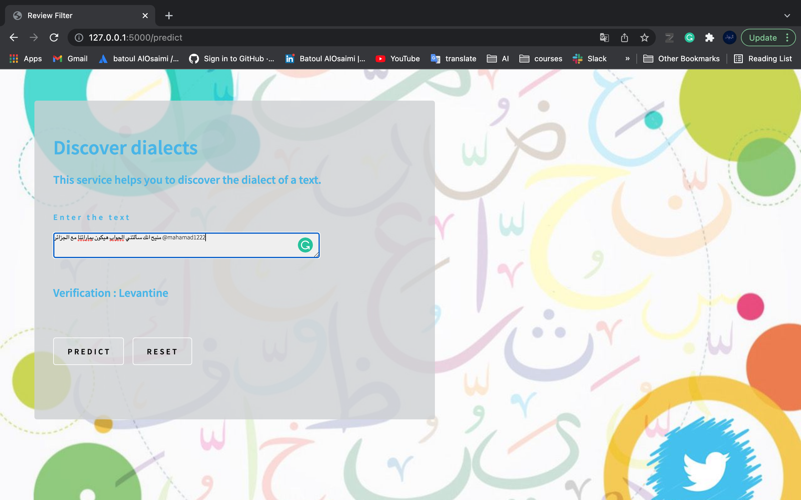

# Arabic dialects

## Introduction
This work that serves the Arabic language. By classifying Arabic dialects in social media through NLP and unsupervised machine learning algorithms. Our Model analyzes texts on social media then categories them into the major Arabic dialects (Nilotic, Gulf, Levantine, or Moroccan). The model reached 0.75 accuracy.

## Design And Data Description
<li> We worked on a public dataset from Kaggle </li>
<li>https://www.kaggle.com/ahmedessam21/arabic-dialect-identificationfreelancing/version/2?select=train.tsv </li>
<li>It contains 62,000 Arabic tweets, but it was not ready to use, during preprocessing we have cleaned data by removing “tashkeel”, removed repeated letters, correct spelling, simplify some writing ways, and remove stop words, etc.</li>

# Methodology:
<li> Collecting data </li>
<li> Preprocessing </li>
<li> Vectorization </li>
<li> Topic modeling </li>
<li> Label Tweet </li>
<li> Exploratory Data Analysis </li>
<li> Prepare data for modeling </li>
<li> Classification </li>

## Test tweet
#### Run app.py 

#### using below command to start Flask API:
```python app.py```

By default, flask will run on port 5000.

- Navigate to URL http://127.0.0.1:5000/

You should be able to view the homepage.

Enter URL  and hit Predict.
If everything goes well, you should be able to see the predicted Verification on the HTML page! check the output here: http://127.0.0.1:5000/predict .

<p align="center">
  
</p>
